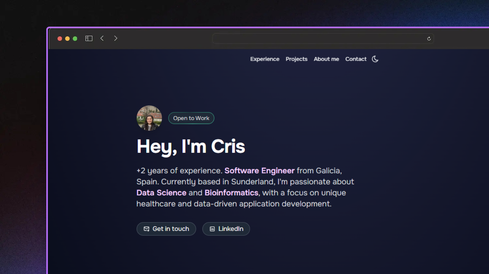

# 🌐 Portfolio - Astro + Tailwind CSS

 <br/>




Welcome to my personal portfolio! This project showcases my skills, previous work, and provides a glimpse into my creative process. Built with **Astro** and styled using **Tailwind CSS**, the site is designed to be fast, responsive and easy to maintain.

## ✨ Features

- **Modern Design:** Utilises the flexibility of Tailwind CSS for styling and a clean layout.
- **Fast Performance:** Leveraging Astro's ability to optimise and deliver minimal JavaScript for a fast loading experience.
- **Responsive:** The design is fully responsive, ensuring a great experience across desktop, tablet, and mobile devices.
- **SEO Optimised:** Astro and Tailwind's built-in best practices make SEO an integral part of the project, improving visibility in search engines.

## 🛠️ Technologies Used

- **Astro:** A modern static site generator that focuses on delivering optimal performance by only sending the necessary JavaScript to the browser.
- **Tailwind CSS:** A utility-first CSS framework that allows for rapid styling with minimal custom CSS.
- **HTML:** Semantic markup for clean, accessible content.
- **JavaScript:** For interactive elements, including form handling and any dynamic behaviour.
  
## 📦 Installation
To run this project locally, you'll need to have **Node.js** installed on your machine. Follow the steps below to get started:

1. Clone this repository:
   ```
   git clone https://github.com/CrisCorreaS/portfolio.dev.git
   ```
2. Navigate into the project directory:
   ```
   cd portfolio.dev
   ```
3. Install the necessary dependencies:
   ```
   npm install
   ```
4. Start the development server:
   ```
   npm run dev
   ```
5. Open your browser and visit `http://localhost:4321` to view the site locally.


## 🚀 Deployment
This portfolio can easily be deployed to various platforms such as Vercel, Netlify, or any static hosting provider.

To deploy on Vercel:

- Push your repository to GitHub.
- Connect your repository to Vercel and follow the prompts to deploy.

## 🔧 Customisation
Feel free to fork and customise this repository. To make changes to the styling, you can modify the tailwind.config.js file. The site’s structure and components are modular, so you can update the layout and design easily without affecting the overall functionality.

## 🙏 Acknowledgements
This portfolio wouldn't have been possible without the valuable resources and support from [MiduDev](https://github.com/midudev). A big thank you for the guidance and inspiration!

## 🤝 Contributing
If you'd like to contribute to this project, feel free to fork the repository and submit a pull request. I welcome suggestions for improvements, new features, or bug fixes.

## 📜 License
This project is licensed under the **Creative Commons Corporation** license.